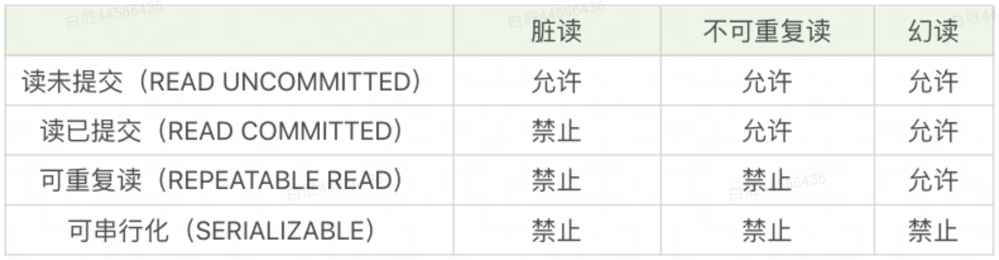

# MySQL

### SQL 是什么

SQL：用于和 DBMS 交互的语言，也是一种开放的标准

MySQL、Oracle 等都是 DBMS

DBMS 最主流的类型是关系型，非关系型的类型有：文档型、键值型、列存储、搜索引擎等

SQL 是**关系型**数据库的查询语言


### SQL 能做什么

- 数据定义（Data Definition Language）：创建，删除和修改数据库和表结构
- 数据查询（Data Query Language）
- 数据操作（Data Manipulation Language）
- 数据控制（Data Control Language）：定义访问权限和安全级别

> 上述只是大致分类，[官方文档](https://dev.mysql.com/doc/refman/8.0/en/sql-statements.html)有详细划分


### MySQL 如何执行

c/s 架构，服务端运行 mysqld 进程。因此使用 MySQL 首先需要启动服务，再建连

mysqld 结构如下：

- 连接层
- sql 层
- 存储引擎层
    - 插件式架构，支持多种存储引擎
    - 每一张表都可以单独指定一种存储引擎

在 sql 层，一条 sql 语句的执行过程如下：

- 缓存查询（MySQL8.0 之后废弃）
- 解析器：语法、语义分析
- 优化器：明确执行路径
- 执行器：权限校验、执行

> sql 语句必须由分号结束


### 数据库操作

- 创建：`CREATE DATABASE [库名];`
- 删除：`DROP DATABASE [库名];`
- 查看：`SHOW DATABASES;`


### 表操作

```sql
CREATE TABLE [表名] (

) ENGINE = [引擎类型] CHARACTER SET = [字符集] COLLATE = [排序规则] ROW_FORMAT = [行格式];
```

字段属性：

- 字段名
- 数据类型
- 是否允许为空
- 默认值
- 唯一性约束
- CHECK 约束
- 自增
- 主键：一张表最多一个索引，因为物理存储顺序是唯一的，主键是和物理存储顺序绑定的，查询效率最高
- 外键
- 索引
- 字符编码
- 排序规则
- 注释


### 数据检索的顺序

关键字的顺序

```sql
SELECT ... DISTINCT ... FROM ... WHERE ... GROUP BY ... HAVING ... ORDER BY ... LIMIT
```

语句执行的顺序

```sql
FROM ... WHERE ... GROUP BY ... HAVING ... SELECT ... DISTINCT ... ORDER BY ... LIMIT
```

每个步骤会产生一个虚拟表，传给下一个步骤


### 子查询

关联子查询（correlated subquery），涉及外部（联表）的子查询，既可以用在 WHERE/EXISTS/IN/ANY/ALL/SOME 中，也可以作为计算字段用在 SELECT 中


### 视图

视图是虚拟的表，本质是一个 sql 查询。增加一层，可用于实现权限控制、数据格式转化、代码复用等目的

尽管视图也支持更新，但并不是为更新设计的（受很多限制），因此不要对视图进行更新操作


### 存储过程

存储过程就是封装了一系列 select 操作的函数，支持传参，函数内可以用 if else 这种流程控制语句

### 游标

即指针。通常面向集合编程，游标提供了面向过程编程的支持


### 事务

- MySQL 的引擎中，InnoDB 支持事务，MyISAM 不支持
- 四大特性（ACID）：原子性是基础，一致性是约束条件，隔离性（Isolation）是手段（避免数据不一致），持久性（Durability）是目的。持久性主要靠事务日志保障，即使发生系统故障，也能基于日志重新执行
- 隐式/显式事务：本质就是是否自动提交，不用自动提交就需要显式写 commit 命令来提交。MySQL 默认是自动提交（隐式），可通过 `set autocommit = 0;` 关闭自动提交
    - 默认设置下，每条 SQL 语句就是一个事务，即执行 SQL 语句后自动提交。为了达到将几个操作做为一个整体的目的，需要使用 BEGIN 或 START TRANSACTION 开启一个事务，或者禁止当前会话的自动提交
    - BEGIN 或 START TRANSACTION 命令之后，一直遇到 COMMIT 或 ROLLBACK 命令，之间的 SQL 语句属于同**一个事务**
- completion_type
    - 0：default
    - 1：commit and chain，自动开启下一个相同隔离级别的事务
    - 2：commit = commit and release
- 并发异常：一个事务，由于其他事务的并发操作，导致不符合预期的情形
    - 脏读（Dirty Read）：读到了不一定最终提交（可能回滚）的数据
    - 不可重复读（Nnrepeatable Read）：when a transaction reads the same row twice but gets different data each time
    - 幻读（Phantom Read）：并发场景中常见的“先检测后操作”类型的问题。A phantom is a row that matches the search criteria but is not initially seen
        - 举例：select 某记录是否存在，不存在，准备插入此记录，但执行 insert 时发现此记录已存在，无法插入，令人产生幻觉
- 隔离级别：区分隔离级别，本质是为了协调并发性能，完全不隔离，性能最好，但会出现异常，完全隔离，不会有并发异常，但性能最低
    - RU：完全不加锁/不隔离
    - RC：对写加锁，所有事务都要等别人写入完成再读
    - RR（MySQL 默认级别）： 
    - S：一个事务对全部要操作的 rows 加互斥锁，完全牺牲并发性
    - 


### 索引

- 索引在 SQL 优化中占了很大的比重，索引优化性能的本质是减少磁盘 I/O 次数
- 索引适用的场景：1、数据量大；2、数据重复度小
    - `过滤因子`：某个过滤条件（谓词条件）查出的行数，占总行数的比例
- 按功能划分
    - 普通索引
    - 唯一索引：即有唯一性约束的普通索引
    - 主键索引：即有非空约束的唯一索引，并且一张表只能有一个
- 按索引的列数划分：
    - 单列索引
    - 联合索引：最左匹配原则
- 按索引的列数划分：
    - 窄索引：查 1～2 列
    - 宽索引：查 >=3 列
- 最佳实践：三星索引
    - 最小化碎片：在WHERE条件语句中，找到所有等值谓词中的条件列，将它们作为索引片中的开始列
    - 避免排序：将 GROUP BY和ORDER BY中的列加入到索引中
    - 避免回表查询：将SELECT字段中剩余的列加入到索引片中


> [MySQL索引原理及慢查询优化](https://tech.meituan.com/2014/06/30/mysql-index.html)


————————————————————————————————————————————

> 参考材料：《MySQL 必知必会》by Ben Forta

> 参考材料：极客时间《SQL必知必会——从入门到数据实战》by 陈旸